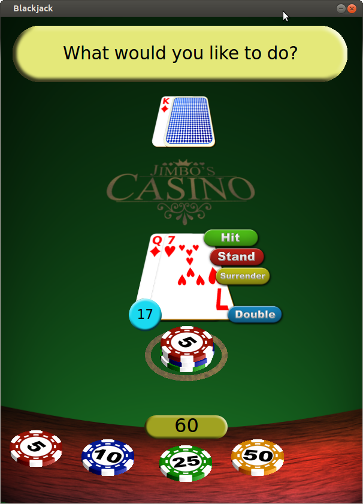
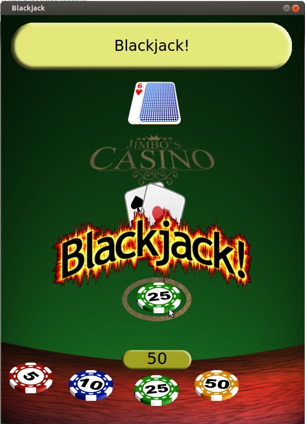
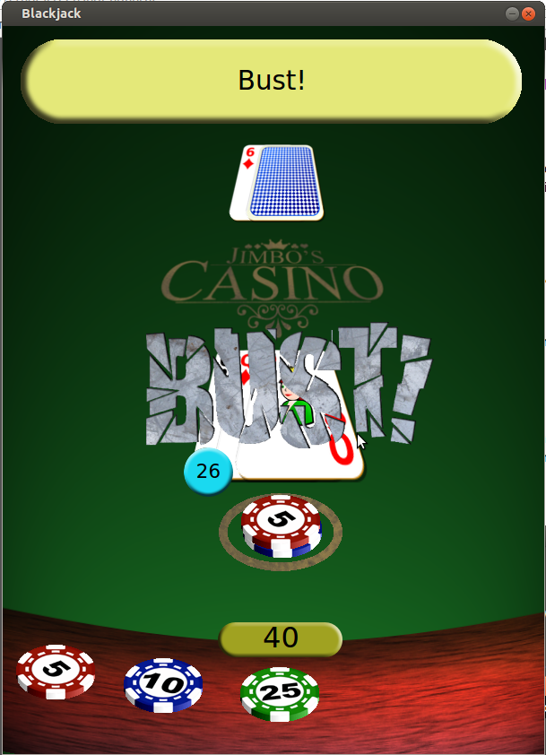

# QtBlackjack

A C++/Qt6 desktop blackjack game that closely follows real casino rules, including doubling, splitting (with unlimited resplits), surrendering, and insurance bets. Features drag‑and‑drop chip betting and sound effects.

## Features

- Follows casino‑style blackjack rules
- Drag‑and‑drop chip betting with Qt6 user interface
- Doubling, splitting, surrendering, and insurance
- Automatic ace value adjustment
- Sound effects for actions and results

## Screenshots





## How To Play

See `HOW_TO_PLAY.md` for full rules and explanations of all actions

## Building from Source

### Requirements

- Qt 6.x
- C++ 13+ compiler
- qmake6

### Build (qmake)

```bash
qmake6
make
./blackjack
```

## Contributing

See `CONTRIBUTING.md` for guidelines on pull requests and testing requirements.

## License

GPL-3.0. See `LICENSE` for details.

